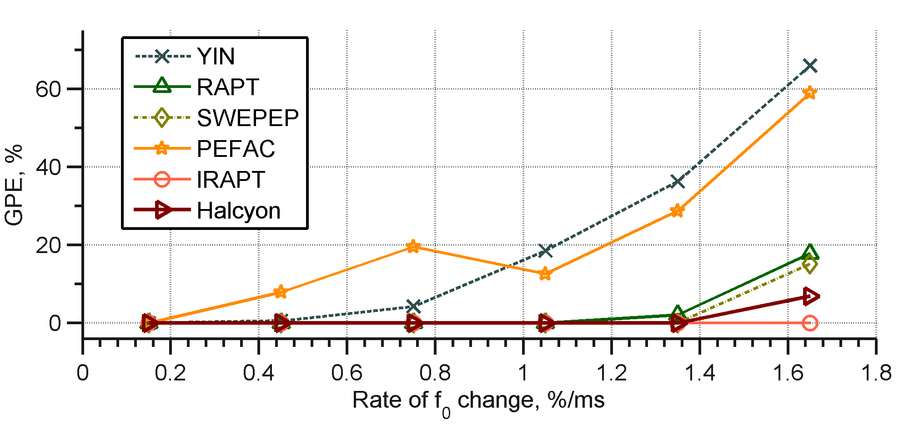

# Halcyon (Instantaneous pitch estimator)


## Abstract
The package contains a Matlab (R2012b) implementation of the instantaneous  pitch estimation algorithm 'Halcyon'.

The algorithm decomposes the signal into subband components and uses their instantaneous representations in order to evaluate candidate generating function. It is assumed that possible pitch variation range is proportional to pitch value. In order to get accurate estimates robust to rapid variations the analysis of signal is carried out using different time scales for each candidate. The algorithm shows a good frequency resolution for pitch-modulated sounds and performs well both in clean and noisy conditions.
### Citation
A short [algorithm]([https://www.bsuir.by/m/12_100229_1_137383.pdf]) description is given in

*Azarov, E., Vashkevich, M. and Petrovsky, A., <a href="https://ieeexplore.ieee.org/document/7472623"> "Instantaneous Pitch Estimation Algorithm Based on Multirate Sampling</a>", In Proc. ICASSP 2016, pp. 4970-4974.*

```
@inproceedings{Azarov-16,
author={E. {Azarov} and M. {Vashkevich} and A. {Petrovsky}},
title={Instantaneous pitch estimation algorithm based on multirate sampling},
year={2016},
booktitle={2016 IEEE International Conference on Acoustics, Speech and Signal Processing (ICASSP)},
pages={4970-4974},
doi={10.1109/ICASSP.2016.7472623}}
```

## Halcyon (example)


## Period candidate generation function (PCGF)
For period candidates generation we use an autocorrelation-based measure. The following figure compares the PCGFs using in RAPT, IRAPT anf Halcyon algorithms.


Figure 1. Period candidates generation. (a) – source signal, (b) – NCCF, (c) – instantaneous model-based NCCF (IRAPT), (d) – proposed period candidate generation function

## Experimental results
The proposed technique is compared with other pitch estimation algorithms in terms of gross pitch error (GPE, %) and mean fine pitch error (MFPE, %).

In order to explore time resolution of the algorithms and their robustness against pitch variations we synthesized artificial signals with changing pitch in the range from 100 to 350 Hz. All obtained measurements were separated into six groups distinguished by variation rate: 0–0.3, 0.3–0.6, 0.6–0.9, 0.9–1.2, 1.2–1.5, >1.5 percent of pitch change per millisecond. Averaged errors are shown in figure 2.

<p align="center">

<p align="center"> Figure 2. Performance for artificial signals </p>

For natural speech experiments the PTDB-TUG speech database was used. Obtained averaged results for clean speech are given in table 1.

<p align="center"> Table 1. Performance for natural speech</p>
<p>
<table  border=1 cellspacing=0 cellpadding=0 width=600>
  <td width=177 rowspan=2 valign=top>
  <p   align=center ><span><o:p>&nbsp;</o:p></span></p>
  </td>
  <td width=256 colspan=2 valign=top >
  <p   align=center ><span>Male<o:p></o:p></span></p>
  </td>
  <td width=273 colspan=2 valign=top >
  <p   align=center><span>Female<o:p></o:p></span></p>
  </td>
 </tr>
 <tr>
  <td width=132 valign=top >
  <p   align=center ><span>GPE<o:p></o:p></span></p>
  </td>
  <td width=124 valign=top >
  <p   align=center><span>MFPE<o:p></o:p></span></p>
  </td>
  <td width=150 valign=top>
  <p   align=center><span>GPE<o:p></o:p></span></p>
  </td>
  <td width=123 valign=top>
  <p   align=center><span>MFPE<o:p></o:p></span></p>
  </td>
 </tr>
 <tr>
  <td width=177 valign=top >
  <p align=center><span>RAPT <o:p></o:p></span></p>
  </td>
  <td width=132 valign=top>
  <p align=center><span>3.69<o:p></o:p></span></p>
  </td>
  <td width=124 valign=top>
  <p align=center><span >1.74<o:p></o:p></span></p>
  </td>
  <td width=150 valign=top>
  <p   align=center><span >6.07<o:p></o:p></span></p>
  </td>
  <td width=123 valign=top>
  <p align=center><span>1.18<o:p></o:p></span></p>
  </td>
 </tr>
 <tr >
  <td width=177 valign=top>
  <p   align=center ><span >YIN <o:p></o:p></span></p>
  </td>
  <td width=132 valign=top>
  <p   align=center ><span >3.18<o:p></o:p></span></p>
  </td>
  <td width=124 valign=top>
  <p   align=center ><span>1.39<o:p></o:p></span></p>
  </td>
  <td width=150 valign=top>
  <p   align=center ><span >3.96<o:p></o:p></span></p>
  </td>
  <td width=123 valign=top>
  <p   align=center ><span >0.84<o:p></o:p></span></p>
  </td>
 </tr>
 <tr>
  <td width=177 valign=top>
  <p   align=center ><span >SWIPE'<o:p></o:p></span></p>
  </td>
  <td width=132 valign=top >
  <p   align=center ><span>0.756<o:p></o:p></span></p>
  </td>
  <td width=124 valign=top>
  <p   align=center ><span>1.51<o:p></o:p></span></p>
  </td>
  <td width=150 valign=top>
  <p   align=center ><span>4.27<o:p></o:p></span></p>
  </td>
  <td width=123 valign=top>
  <p   align=center ><b><span>0.80<o:p></o:p></span></b></p>
  </td>
 </tr>
 <tr >
  <td width=177 valign=top >
  <p  align=center ><span>PEFAC<o:p></o:p></span></p>
  </td>
  <td width=132 valign=top>
  <p align=center ><span> 20.521<o:p></o:p></span></p>
  </td>
  <td width=124 valign=top>
  <p  align=center ><span> 1.383<o:p></o:p></span></p>
  </td>
  <td width=150 valign=top>
  <p align=center><span> 31.192<o:p></o:p></span></b></p>
  </td>
  <td width=123 valign=top >
  <p align=center><span> 0.972<o:p></o:p></span></p>
  </td>
 </tr>
 <tr>
  <td width=177 valign=top >
  <p   align=center ><span  >IRAPT<o:p></o:p></span></p>
  </td>
  <td width=132 valign=top>
  <p   align=center ><span  >1.63<o:p></o:p></span></p>
  </td>
  <td width=124 valign=top>
  <p   align=center ><span>1.61<o:p></o:p></span></p>
  </td>
  <td width=150 valign=top>
  <p   align=center><span>3.78<o:p></o:p></span></p>
  </td>
  <td width=123 valign=top>
  <p   align=center ><span >0.98<o:p></o:p></span></p>
  </td>
 </tr>
 <tr >
  <td width=177 valign=top >
  <p  align=center ><span>Halcyon<o:p></o:p></span></p>
  </td>
  <td width=132 valign=top>
  <p align=center ><span><b>0.743</b><o:p></o:p></span></p>
  </td>
  <td width=124 valign=top>
  <p  align=center ><span><b>1.268</b><o:p></o:p></span></p>
  </td>
  <td width=150 valign=top>
  <p align=center><span> <b>3.600</b> <o:p></o:p></span></b></p>
  </td>
  <td width=123 valign=top >
  <p align=center><span>1.039<o:p></o:p></span></p>
  </td>
 </tr>
</table>
</p>


